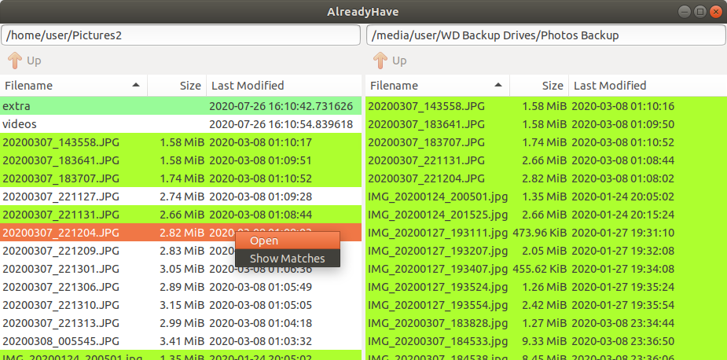

# AlreadyHave

AlreadyHave is a GUI Python tool for visualizing the differences between folders. It is useful for seeing which files are not yet copied from one folder to another. In the same way, it can be used to determine if two of the same files exist anywhere across two folders.

## Usage

### Typical: only require file sizes and names to match
`python ./alreadyhave.py dir1 dir2`

### Exacting: require file sizes and SHA-256 hashes to match
`python ./alreadyhave.py dir1 dir2 --match-hash --no-match-filename`

## Tests

Run `python -m test.tests` from the root directory of this repository to run all unit tests.
